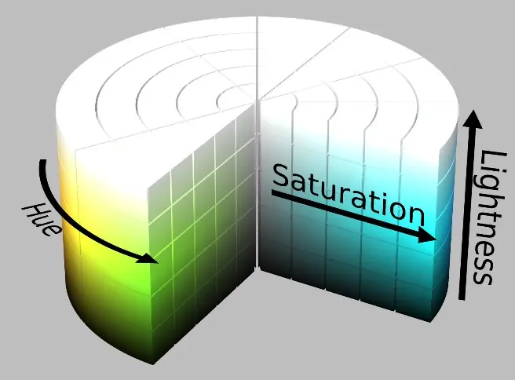
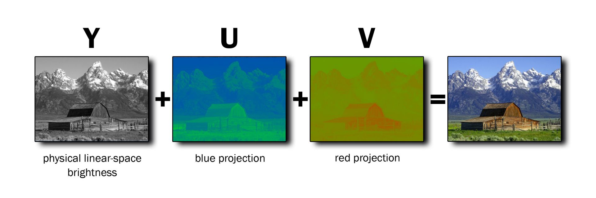
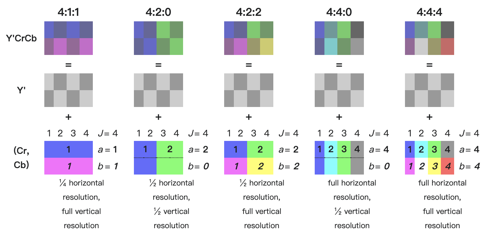
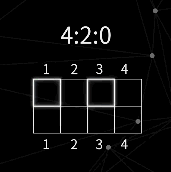

## 从相机入手

最近入手了富士的2022年上市的旗舰机`X-T5`，选择相机时我往往会关注设备的拍照和视频参数，其中往往就会看到4:2:2、10bit等字样，这些字样也经常会在音视频领域出现。作为一名关注设备的摄影爱好者，自然少不了看一些器材推荐和科普视频，`影视飓风`也专门为其出过一期科普视频。

### 422，420，10bit，8bit？这些究竟是什么
视频来源：[影视飓风](https://space.bilibili.com/946974).
<iframe width="100%" height="468" src="//player.bilibili.com/player.html?bvid=BV1ds411T7F4&p=1&autoplay=false" scrolling="no" border="0" frameborder="no" framespacing="0" allowfullscreen="true"> </iframe>

视频质量相当之高，但在观看视频学习过程中对于色度采样我没有理解到位，于是便有了这篇记录学习过程的文章。

开始发现自己写的博客有点不精简

## 色深
色深，即每个像素的红、黄、蓝通道分别是由多少位bit的数据来表示的。

Adobe PhotoShop、颜色选择器中我们经常会看到，通道的色彩选择范围是0到255的数字，0-255共256个数字在二进制中可以用8位数字来表示，该RGB系统即8bit系统。意味着每个RGB通道都有256种色调，因此在这个系统中总共有`256 x 256 x 256`即`16,777,216`种颜色。

尽管8bit的`16,777,216`这个数字十分的庞大，但所有颜色的表示终究只是一个个离散的值，并不可能做到无极变化，面对动态范围较大的素材时，往往会发现色彩复杂的渐变场景有出现色彩断层、色带的情况，如上右图中太阳周围的余晖可以看到这一明显现象。

10bit解决的正是这个问题，在10bit系统中，您可以产生 `1024 x 1024 x 1024 = 1,073,741,824`即`10亿`种颜色，这是8bit颜色的`64`倍。数据越多，表达的颜色范围也就越多，过渡也就会更加自然。更令人震惊的是，12bit系统能够产生高达`4096 x 4096 x 4096 = 68,719,476,736`种颜色！ 因此，增加颜色深度将使您能够更好地表现颜色。

当然，色深的位数越多，也会带来更多的数据量和更大的存储负担。

## 从颜色空间出发，到YUV
### 1. RGB
我们常接触的颜色编码方案是`RGB`，它简单、清晰、易懂，正如上面`色深`中提到的通过将三原色的组合能够将每个像素的颜色都进行展示；
RBG里也有很多门道，生物学角度同等亮度下，人眼感知绿色要强于其他所有颜色，在`RGB16`中采用`565`格式，绿色通道被分配了比红色和蓝色更多的一位（6位而非5位）。这样做可以提供更精细的绿色色调表示，使得图像色彩的整体感知更加自然和平衡。
### 2. CMYK
在印刷领域，犹豫印刷颜料的问题，三原色变成了青（Cyan）、品红（Magenta）、黄（Yellow），印刷颜色混合的黑色不够纯，而Black的首字母又被其他规范中的Blue占用，于是引入了K（Black）便有个`CMYK`；
### 3. HSL和HSV
如果你有时使用图片处理软件制作海报或进行后期处理，可能会遇到`颜色太艳丽了，饱和度降低一点儿就好了`、`这里的红色太亮了`等等描述，在设计行业十分常见，此时，`RGB`并不能直观地表示出这饱和度、亮度等信息这一点，因此有了`HSL`和`HSV`颜色空间。

`HSL`和`HSV`比`RGB`更接近人们对彩色的感知经验。非常直观地表达颜色的色调、鲜艳程度和明暗程度，方便进行颜色的对比。

`HSV`表达彩色图像的方式由三个部分组成：
* H: Hue（色调、色相）
* S: Saturation（饱和度、色彩纯净度）
* V: Value（明度）

`HSL`则是将`V`进行替换，两者十分类似
* L: Lightness（亮度）

### 4. YUV
在彩色电视出现之前，电视系统是黑白的，只传输亮度信息。YUV格式设计时，需要考虑彩色电视的设计方案需要与已存在的黑白电视进行兼容，能够在亮度信息上扩展增加色度信息，于是YUV便出现了。
YUV由以下分量组成：
* Y分量：表示亮度信息，是图像的灰度版本，对应黑白影像。
* U和V分量：表示色度信息，用于描述色彩和饱和度。U通常指蓝色亮度差分量（蓝色与亮度的差），而V指红色亮度差分量（红色与亮度的差）。

#### 总结
每个像素可以分为`亮度信息`（Y）和`色度信息`（UV或CrCb）。如果去掉一个画面的色度信息，就会获得一个黑白的画面；如果把亮度值去掉，就会得到一片黑暗。很多年前就有研究发现，人的眼睛对`亮度信息`相比于`色度信息`更加的敏感，一个画面需要保留`亮度信息`，而`色度信息`可以通过多个像素共用一个色度值来呈现出人眼看到接近的效果，这提供了一个很好的减少数据量的方法。

## 色度采样（Chroma sampling）
>我们经常会见到`4:4:4`、`4:2:2`、`4:2:0`、`4:1:1`等字样，这些代表了色度采样方案。

采样方案中通常表示为三个部分的比率`J:a:b`（例如4:2:2），并描述`J x 2`像素内区域的亮度和色度样本，他们分别代表的含义是：
* J：水平采样参考（概念区域的宽度）通常是4，例如下面图中一个个都是`4 x 2`的像素区域。很多博客会说是观测多少个像素甚至将区域划分成一个个2 x 2的区域来解释4的由来，这是不对的；
* a：第一行J个像素中色度样本（Cr，Cb）的数量，也就是说我们要在横向的J个像素中采样多少个样本，采样的越多信息越完整，越少则会丢失一部分信息。例如`4:4:4`中第一行对4个样本进行采样，也就是每个样本我们都获取了它的色度信息，`4:2:2`中也就是仅采样两个色度信息，即两个像素共用一个色度信息；
* b：第一行和第二行J像素之间色度样本（Cr，Cb）的变化数量。我们可以从`4:1:1`和`4:2:0`的例子中很好的理解。但注意b需要满足`b == a || b == 0`(除了罕见的情况4:4:1和4:2:1，他们不遵循该约定)

以`4:2:0`和`4:1:1`举例。
1. `4:2:0`代表在`4 x 2`的像素区域内采样，第一行的`J = 4`个像素中采样`2`个信息，每两个像素共用一个色度信息，而第二行相比于第一行发生了`0`个变化，即第二行需要继承第一行的色度采样值，可以看到左边的`2 x 2`共用一个色度信息，右边的`2 x 2`共用一个色度信息；

2. `4:1:1`代表在`4 x 2`的像素区域内采样，第一行的`J = 4`个像素中采样`1`个信息，第一行共用一个色度信息，而第二行相比于第一行发生了`1`个变化，即第二行重新采样，即总图中第一行4个像素共享一个色度信息，第二行4个像素共享一个色度信息。

### 色度采样的作用
色度采样的伟大之处便是，利用[YUV总结](#summary)中提到的，通过保留亮度信息，并对色度信息进行采样来减少数据量。可以看到，`4:4:4`中在`4 x 2`区域内我们需要采样8个色度信息，也就是每个像素都需要采样，而`4:2:2`中，我们仅需要采样4个色度信息，相比于`4:4:4`已经压缩了`50%`，甚至在`4:2:0`中，我们仅需要采样2个色度信息，这压缩扔掉了`75%`的数据。

日常前期拍摄情况下`4:2:0`已经可以记录非常不错的画面，当遇到需要扣像、精细后期处理的场景`4:4:4`或`4:2:2`才是更好的选择，需要在数据量和需求之前作出相应的取舍。总的来说，色度采样利用YUV格式，既考虑到了技术和经济的实际需求，也利用了人类视觉的特性，实现了高效的图像和视频处理。