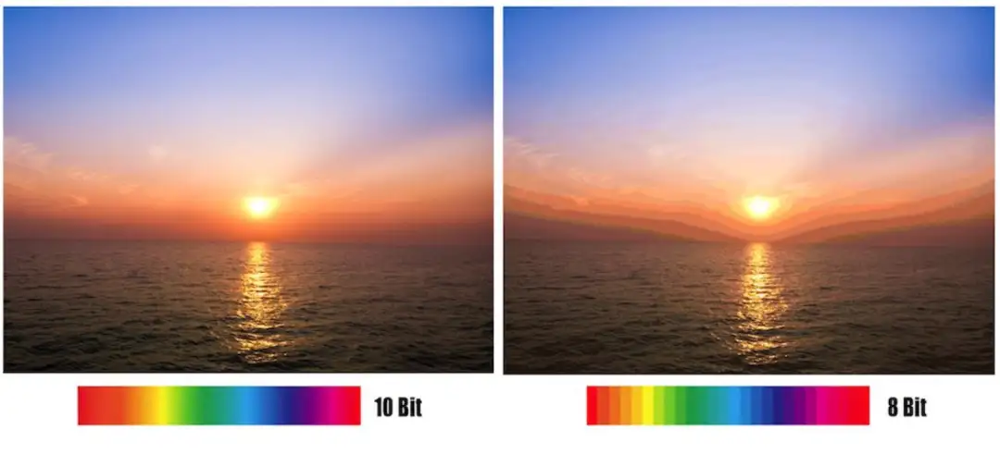

## 从相机入手

最近入手了富士的2022年上市的旗舰机`X-T5`，选择相机时我往往会关注设备的拍照和视频参数，其中往往就会看到4:2:2、10bit等字样，这些字样也经常会在音视频领域出现。作为一名关注设备的摄影爱好者，自然少不了看一些器材推荐和科普视频，`影视飓风`也专门为其出过一期科普视频。

### 422，420，10bit，8bit？这些究竟是什么
视频来源：[影视飓风](https://space.bilibili.com/946974).
<iframe width="100%" height="468" src="//player.bilibili.com/player.html?bvid=BV1ds411T7F4&p=1&autoplay=false" scrolling="no" border="0" frameborder="no" framespacing="0" allowfullscreen="true"> </iframe>

视频质量相当之高，但在观看视频学习过程中对于色度采样我没有理解到位，于是便有了这篇记录学习过程的文章。

开始发现自己写的博客有点不精简

## 色深
色深，即每个像素的红、黄、蓝通道分别是由多少位bit的数据来表示的。

Adobe PhotoShop、颜色选择器中我们经常会看到，通道的色彩选择范围是0到255的数字，0-255共256个数字在二进制中可以用8位数字来表示，该RGB系统即8bit系统。意味着每个RGB通道都有256种色调，因此在这个系统中总共有`256 x 256 x 256`即`16,777,216`种颜色。

尽管8bit的`16,777,216`这个数字十分的庞大，但所有颜色的表示终究只是一个个离散的值，并不可能做到无极变化，面对动态范围较大的素材时，往往会发现色彩复杂的场景有出现色彩断层、色带的情况。

10bit解决的正是这个问题，在10bit系统中，您可以产生 `1024 x 1024 x 1024 = 1,073,741,824`即`10亿`种颜色，这是8bit颜色的`64`倍。数据越多，表达的颜色范围也就越多，过渡也就会更加自然。更令人震惊的是，12bit系统能够产生高达`4096 x 4096 x 4096 = 68,719,476,736`种颜色！ 因此，增加颜色深度将使您能够更好地表现颜色。

当然，色深的位数越多，也会带来更多的数据量和更大的存储负担。

## YUV
我们常接触的颜色编码方案是`RGB`，它简单、清晰、易懂，正如上面`色深`中提到的通过将三原色的组合能够将每个像素的颜色都进行展示；

在印刷领域，犹豫印刷颜料的问题，三原色变成了青（Cyan）、品红（Magenta）、黄（Yellow），印刷颜色混合的黑色不够纯，而Black的首字母又被其他规范中的Blue占用，于是引入了K（Black）便有个`CMYK`；

