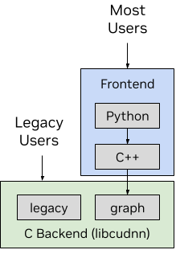

# cudnn学习笔记

- NVIDIA® CUDA® Deep Neural Network library (cuDNN) is a GPU-accelerated library of primitives for deep neural networks. cuDNN provides highly tuned implementations for standard routines, such as forward and backward convolution, attention, matmul, pooling, and normalization.



cudnn分前端和后端，包含了`frontend`和`backend`

- frontend：提供了简化的编程模型，满足大多数用例
- backend：想要使用那些graph和legacy，使用C语言来定制接口

# How cuDNN works

- **加速学习**：提供内核，在合理时针对张量核心，以实现计算受限作的最佳性能。它提供了针对特定问题大小选择正确核的启发式方法。
- **融合支持：**cuDNN 支持计算受限和内存受限作的融合。常见的通用融合模式通常通过运行时内核生成实现。专用融合模式通过预编写的核进行优化。
- **表达式作图 API：** 用户将计算定义为张量运算图。cuDNN 库既有直接的 C API，也有开源的 C++ 前端以增加便利性。大多数用户选择前端作为进入 cuDNN 的入口

# cuDNN Frontend

Install backend on Linux

```bash
# install zlib package
sudo apt-get install zlib1g
# Refresh the repository metadata.
sudo apt-get update
# Install the per-CUDA meta-packages.
sudo apt-get -y install cudnn9-cuda-12
# 也可以安装JIT-轻量灵活，即时编译
sudo apt-get -y install cudnn9-jit-cuda-12
```

check status

```bash
import torch
print(torch.version.cuda)
print(torch.backends.cudnn.version()) # 测试后端
import cudnn # 测试前端
```

输出结果

```bash
12.8
91002
```

python前端代码想要运行需要恰当的安装前端支持

```bash
pip install nvidia_cudnn_frontend
# or
apt-get install python-dev
```

## 使用

具体Python例子

```bash
import torch
import cudnn

# Prepare sample input data. nvmath-python accepts input tensors from pytorch, cupy, and
# numpy.
b, m, n, k = 1, 1024, 1024, 512
A = torch.randn(b, m, k, dtype=torch.float32, device="cuda")
B = torch.randn(b, k, n, dtype=torch.float32, device="cuda")
bias = torch.randn(b, m, 1, dtype=torch.float32, device="cuda")

result = torch.empty(b, m, n, dtype=torch.float32, device="cuda")

# Use the stateful Graph object in order to perform multiple matrix multiplications
# without replanning. The cudnn API allows us to fine-tune our operations by, for
# example, selecting a mixed-precision compute type.
graph = cudnn.pygraph(
   intermediate_data_type=cudnn.data_type.FLOAT,
   compute_data_type=cudnn.data_type.FLOAT,
)

a_cudnn_tensor    = graph.tensor_like(A)
b_cudnn_tensor    = graph.tensor_like(B)
bias_cudnn_tensor = graph.tensor_like(bias)

c_cudnn_tensor = graph.matmul(name="matmul", A=a_cudnn_tensor, B=b_cudnn_tensor)
d_cudnn_tensor = graph.bias(name="bias", input=c_cudnn_tensor, bias=bias_cudnn_tensor)

# Build the matrix multiplication. Building returns a sequence of algorithms that can be
# configured. Each algorithm is a JIT generated function that can be executed on the GPU.

graph.build([cudnn.heur_mode.A])
workspace = torch.empty(graph.get_workspace_size(), device="cuda", dtype=torch.uint8)

# Execute the matrix multiplication.
graph.execute(
   {
       a_cudnn_tensor: A,
       b_cudnn_tensor: B,
       bias_cudnn_tensor: bias,
       d_cudnn_tensor: result,
   },
   workspace
)
```