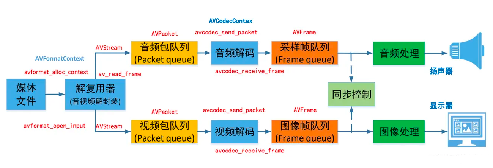

## FFmepg

`FFmpeg`含义是`Fast Forward Moving Picture Experts Group`，是一个免费开源的用于处理音视频的命令行工具

### 1.从播放器框架开始讲起

音视频的术语：

1. 容器/文件（Container/file）：特定格式的多媒体文件，如 mp4、flv、mkv 等；
2. 媒体流（Stream）：时间轴上一段连续的数据，如一段声音数据、一段视频数据或一段字幕数据，如果数据是压缩的需要关联特定的编解码器；
3. 数据帧/包（Frame/Packet）：一个媒体流由大量的数据帧组成，帧就是 Codec 的最小处理单元；
4. 编解码器（Codec）：以帧为单位实现压缩数据和原始数据互相转换的工具。

### 2.常用概念

1. 复用器：多个数据流合成一个数据流，处理的是已经压缩或编码后的音视频数据，将它们合并在一起。主要任务是合并音频和视频数据流，例如 flv、mp4
2. 编解码器：负责压缩和解压缩音视频数据。有视频编解码器（H264/AVC、H265/HEVC、VP9）和音频编解码器（AAC、MP3）

### 3.FFmpeg 的整体结构

1. 工具层面（Tools）

- ffmpeg：最主要的工具，用于录制、转换和流式传输音视频。支持各种输入输出格式和编码器
- ffplay：简单的播放器，用于播放音视频文件
- ffprobe：分析工具，用于显示音视频的信息，格式、编码、比特率、帧率等，对调试和了解文件内部很有帮助

2. 库（Libraries）
   `FFmpeg`包含多个功能强大的库，分别负责不同的任务：

- `libavcodec`：包含所有音视频编解码器，是`FFmpeg`的核心库之一。它支持多种音视频编码和解码格式，不会默认添加 libx264、FDK-AAC 等库，而是以插件的形式为开发者提供统一的接口。
- `libavformat`：包用于封装和解封装各种多媒体格式。它负责处理文件的容器格式，例如 MP4、MKV、AVI 等。
- `libavutil`：包含通用的工具函数和数据结构，用于支持其他库的功能，例如内存管理、数据操作等。
- `libswscale`：用于图像缩放和色彩空间转换。在处理视频时，常常需要对图像进行缩放和转换，这个库提供了高效的实现。
- `libswresample`：用于音频重采样和格式转换。例如，将音频从一种采样率转换到另一种采样率，或从一种声道布局转换到另一种声道布局。
- `libavfilter`：提供了一系列音视频过滤器，提供音视频的特效处理，可以对音视频流进行各种处理，例如裁剪、缩放、添加特效等。
- `libPostProc`：该模块可用于进行后期处理，当我们使用 AVFilter 的时候需要打开该模块的开关，因为 Filter 中会使用到该模块的一些基础函数。

[参考博客](https://lazybing.github.io/blog/categories/ffmpegyuan-ma-fen-xi/)
