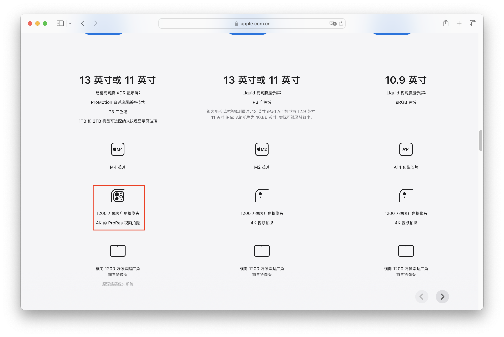
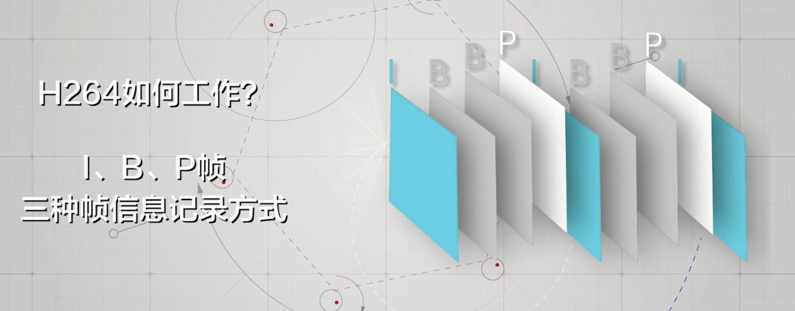
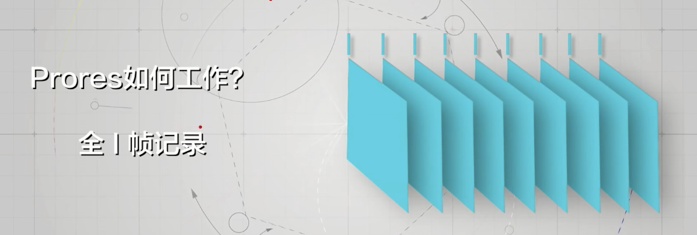

## 走进 ProRes

上面是一张苹果官网的 ipad 页面，选配时最高端的 ipad pro 型号一大特点就是可以录制 ProRes 格式，如果你和我一样经常关注数码摄影，可以在手机或相机发布会的视频录制参数中提及相关话术，那么什么是 ProRes？

[苹果官网 ProRes 介绍](https://support.apple.com/zh-cn/118584)
苹果官网是这么写的：

> 完美结合了多流实时编辑性能、超高图像质量以及较低储存速率的编解码器

开发`ProRes`的目的起初是为了自家的剪辑软件 Final Cut Pro 进行视频处理用的，ProRes 是有损压缩，相比于主流的`H.264`，`ProRes`具有编解码效率高的特点，可以在后期编辑使用中更加的流畅，但是体积相比`H.264`体积会大出很多，之后我们会解释发生这个的原因。

## ProRes 和 H.264

`H.264`这类高压缩编码都是帧间编码，其中有 3 种类型的帧，即 IPB。

- `I帧`是关键帧，压缩程度较低，关键帧上所有信息都会被记录。
- `P帧`表示这一帧跟之前一帧的差别（向前搜索），解码时需要用之前缓存的画面叠加上本帧定义的差别，生成最终画面。
- `B帧`是双向差别帧，即 B 帧记录的是本帧与前后帧的差别（双向搜索）。解码 B 帧需要该帧之前的缓存和之后的画面，通过前后画面和本帧叠加得到，B 帧压缩率高，但是解码时处理器性能消耗会比较大。

由于 P 帧和 B 帧是不同类型的预测帧，去除了一些冗余，压缩率高不少。这样处理的好处是，数据量会小很多，但是会损失一些细节，用于交付（网络传播）很有优势。

`ProRes`是帧内编码，是通过全 I 帧记录的。没有 P 帧和 B 帧，因此在记录的数据上，所存储的信息也就更多，这就导致了体积更大。但是由于 ProRes 全 I 帧记录没有 P 帧和 B 帧这种预测帧，因此它的编解码效率是非常高的，这样可以很大的降低后期剪辑处理视频文件时的编解码压力。
