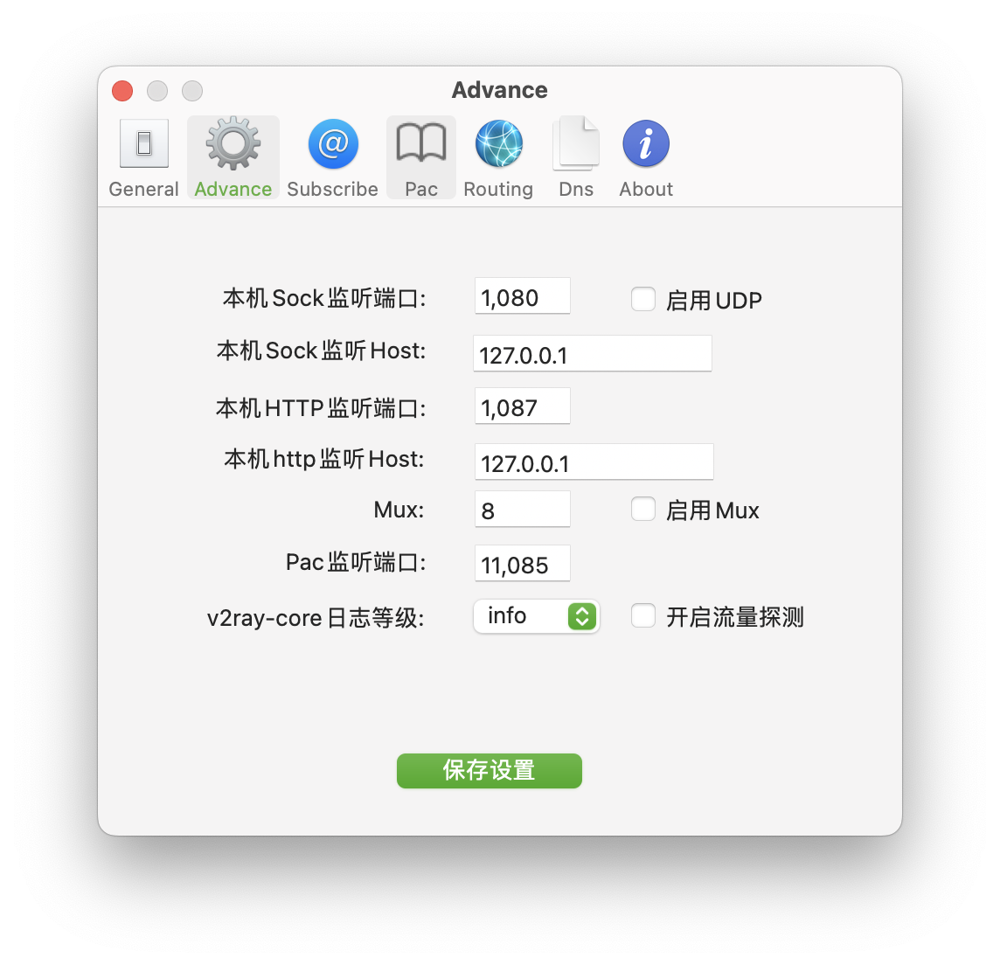
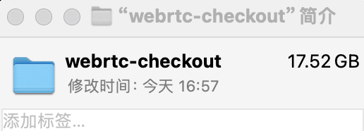
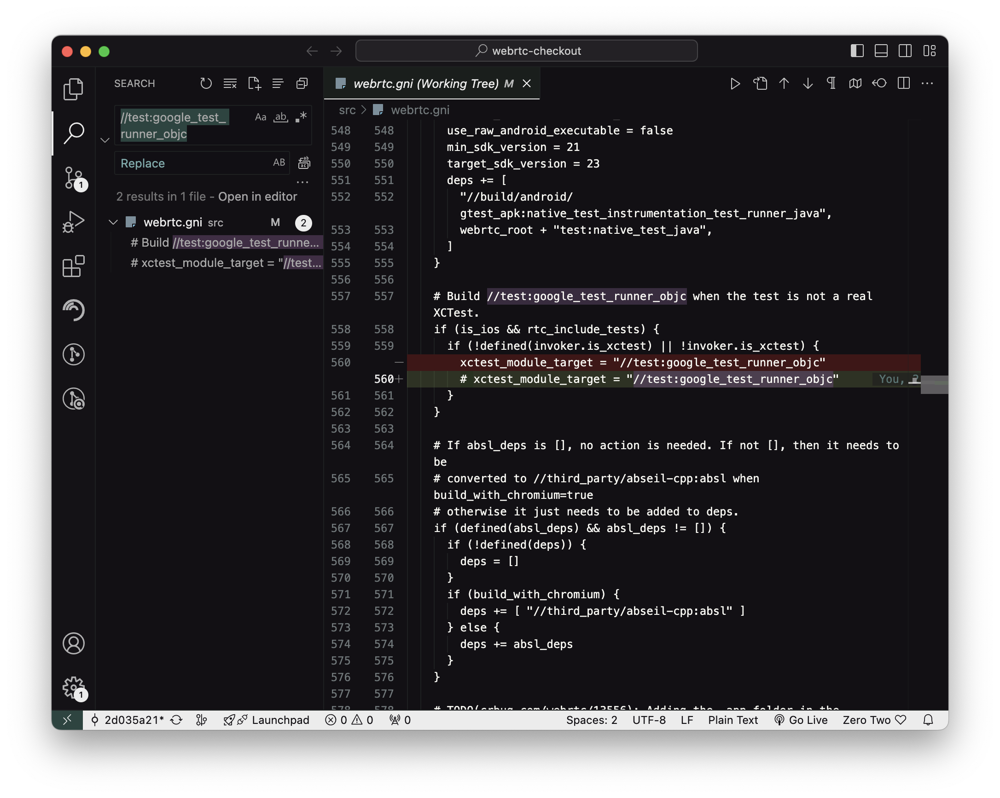

## WebRTC 下载源码并编译为动态库

记录一次 macOS 系统`下载WebRTC源代码和编译`（~~踩坑~~）的全过程

### 1. 安装 depot_tools 工具包

`depot_tools`是 google 开发的管理 Chromium 源代码的工具，因此，我们需要首先安装`depot_tools`

```bash
git clone https://chromium.googlesource.com/chromium/tools/depot_tools.git
```

使用如下命令检测是否需要翻墙

```bash
curl www.google.com
```

如果出现错误，需要使用 VPN 软体辅助下载，终端并不会自动识别 VPN 所走的端口，需要我们单独配置，这里我使用的是`v2ray`如下图所示：


如图中所示，VPN 使用的 Sock 为`127.0.0.1:1080`，终端使用`zsh`，因此为方便随时在终端可以快速开关 VPN，需要在`~/.zshrc`中进行配置，如果使用的`bash`同理可以在`~/.bash_profile`配置，具体如下：

```bash
vim ~/.zshrc
```

在结尾处添加（[有坑](#problem1)，后面会提到）

```bash
# proxy
alias proxy_on='export all_proxy=socks5://127.0.0.1:1080'
alias proxy_off='unset all_proxy'
```

含义是创建了两个快捷指令，在终端输入`proxy_on`和`proxy_off`便可以用于终端快速启用和关闭翻墙，当然前提是提前打开翻墙软件。

如果发现命令执行不了可以使用

```bash
source ~/.zshrc
```

这是因为对于已经打开的终端，修改是不会自动应用的。上面的命令可以应用所有更改，当然你重新打开一下终端，两者作用相同。

**结果**

```bash
(base) sarah@MBP WebRTC % git clone https://chromium.googlesource.com/chromium/tools/depot_tools.git
Cloning into 'depot_tools'...
remote: Finding sources: 100% (9/9)
remote: Total 59597 (delta 39218), reused 59594 (delta 39218)
Receiving objects: 100% (59597/59597), 58.57 MiB | 5.10 MiB/s, done.
Resolving deltas: 100% (39218/39218), done.
```

### 2. 安装 depot_tools 工具包

添加环境变量

```bash
export PATH=/path/to/depot_tools:$PATH
```

我的路径是`/Users/sarah/Documents/WebRTC/depot_tools`，所以执行

```bash
export PATH=/Users/sarah/Documents/WebRTC/depot_tools:$PATH
```

每次重新打开终端该配置就会失效，检测是否安装成功

```bash
fetch --help
```

#### <span id="problem1">个人遇到的问题</span>

这里我发现自己运行失败了，并且遇到了问题

```bash
xxx/WebRTC/depot_tools/vpython3: line 52: xxx/WebRTC/depot_tools/.cipd_bin/vpython3: No such file or directory
xxx/WebRTC/depot_tools/vpython3: line 52: exec: xxx/WebRTC/depot_tools/.cipd_bin/vpython3: cannot execute: No such file or directory
```

在搜索之后，通过一则 github 的[issue](https://github.com/termux/termux-app/issues/698)中找到了解决方法，也与前面的翻墙有关，如果正常可以操作请忽略此步骤。

前面我使用的`sock5`配置的翻墙软件，需要把`127.0.0.1`替换成`localhost`即可。使用`http`的同理，并且注意一定要是`http://`开头而不是`https://`。
出现这个问题的原因可能是`127.0.0.1`没有正确解析、或 IP 地址没有被代理软件正确捕获所导致。

```bash
# proxy
alias proxy_on='export all_proxy=socks5://localhost:1080'
alias proxy_on2='export all_proxy=http://localhost:1087'
alias proxy_off='unset all_proxy'
```

重新运行`fetch --help`

```bash
(base) sarah@qinStonedeMBP webrtc-checkout % fetch --help
usage: fetch.py [-h] [-n] [--nohooks] [--nohistory] [--force]
                [-p PROTOCOL_OVERRIDE]
                config ...

    This script can be used to download the Chromium sources. See
    http://www.chromium.org/developers/how-tos/get-the-code
    for full usage instructions.

positional arguments:
  config                Project to fetch, e.g. chromium.
  props

options:
  -h, --help            show this help message and exit
  -n, --dry-run         Don't run commands, only print them.
  --nohooks, --no-hooks
                        Don't run hooks after checkout.
  --nohistory, --no-history
                        Perform shallow clones, don't fetch the full git
                        history.
  --force               (dangerous) Don't look for existing .gclient file.
  -p PROTOCOL_OVERRIDE, --protocol-override PROTOCOL_OVERRIDE
                        Protocol to use to fetch dependencies, defaults to
                        https.

Valid fetch configs:
  android
  android_internal
  angle
  breakpad
  chrome
  chromium
  config_util
  crashpad
  dart
  depot_tools
  devtools-frontend
  devtools-internal
  flutter
  gn
  gyp
  infra
  infra_internal
  infra_superproject
  inspector_protocol
  ios
  ios_internal
  nacl
  naclports
  node
  node-ci
  pdfium
  skia
  skia_buildbot
  syzygy
  v8
  webrtc
  webrtc_android
  webrtc_ios
  website
```

### 3. 下载 WebRTC 源码

参考网站：[WebRTC 官网](https://webrtc.github.io/webrtc-org/native-code/development/#)、[WebRTC Native Code, iOS](https://webrtc.github.io/webrtc-org/native-code/ios/)

#### 下载代码

在官网上有写明

> NOTICE: During your first sync, you’ll have to accept the license agreement of the Google Play Services SDK.
> The checkout size is large due the use of the Chromium build toolchain and many dependencies. Estimated size:
> Linux: 6.4 GB.
> Linux (with Android): 16 GB (of which ~8 GB is Android SDK+NDK images).
> Mac (with iOS support): 5.6GB

因此建议预留足够的内存空间。

```bash
mkdir webrtc-checkout
cd webrtc-checkout
fetch --nohooks webrtc_ios
```

执行完以后你就会惊喜的发现，不是哥们儿～我内存呢？


与远端代码同步执行以下命令

```bash
gclient sync
```

执行结果

```bash
(base) sarah@qinStonedeMBP webrtc-checkout % gclient sync
Syncing projects: 100% (49/49), done.
________ running 'python3 src/build/mac_toolchain.py' in '/Users/sarah/Documents/WebRTC/webrtc-checkout'
Skipping Mac toolchain installation for mac
Running hooks:  44% (13/29) clang
________ running 'python3 src/tools/clang/scripts/update.py' in '/Users/sarah/Documents/WebRTC/webrtc-checkout'
Downloading https://commondatastorage.googleapis.com/chromium-browser-clang/Mac/clang-llvmorg-19-init-10646-g084e2b53-1.tar.xz .......... Done.
Downloading https://commondatastorage.googleapis.com/chromium-browser-clang/Mac/clang-llvmorg-19-init-10646-g084e2b53-1.tar.xz .......... Done.
Hook 'python3 src/tools/clang/scripts/update.py' took 34.49 secs
Running hooks:  62% (18/29) dsymutil_mac_x64
________ running 'python3 src/third_party/depot_tools/download_from_google_storage.py --no_resume --no_auth --bucket chromium-browser-clang -s src/tools/clang/dsymutil/bin/dsymutil.x64.sha1 -o src/tools/clang/dsymutil/bin/dsymutil' in '/Users/sarah/Documents/WebRTC/webrtc-checkout'
NOTICE: You have PROXY values set in your environment, but gsutil in depot_tools does not (yet) obey them.
Also, --no_auth prevents the normal BOTO_CONFIG environment variable from being used.
To use a proxy in this situation, please supply those settings in a .boto file pointed to by the NO_AUTH_BOTO_CONFIG environment variable.
0> Downloading src/tools/clang/dsymutil/bin/dsymutil@05a1fbfceb62efb3ce10c94f1c7dd40b56e406f1...
Downloading 1 files took 22.052359 second(s)
Hook 'python3 src/third_party/depot_tools/download_from_google_storage.py --no_resume --no_auth --bucket chromium-browser-clang -s src/tools/clang/dsymutil/bin/dsymutil.x64.sha1 -o src/tools/clang/dsymutil/bin/dsymutil' took 22.17 secs
Running hooks:  68% (20/29) clang_format_mac_x64
________ running 'python3 src/third_party/depot_tools/download_from_google_storage.py --no_resume --platform=darwin --no_auth --bucket chromium-clang-format -s src/buildtools/mac/clang-format.x64.sha1 -o src/buildtools/mac/clang-format' in '/Users/sarah/Documents/WebRTC/webrtc-checkout'
NOTICE: You have PROXY values set in your environment, but gsutil in depot_tools does not (yet) obey them.
Also, --no_auth prevents the normal BOTO_CONFIG environment variable from being used.
To use a proxy in this situation, please supply those settings in a .boto file pointed to by the NO_AUTH_BOTO_CONFIG environment variable.
0> Downloading src/buildtools/mac/clang-format@0b4bd257a1f4cd27d27d6919b0f9e52ecdfa8f1e...
Downloading 1 files took 10.302379 second(s)
Hook 'python3 src/third_party/depot_tools/download_from_google_storage.py --no_resume --platform=darwin --no_auth --bucket chromium-clang-format -s src/buildtools/mac/clang-format.x64.sha1 -o src/buildtools/mac/clang-format' took 10.41 secs
Running hooks:  89% (26/29)
________ running 'download_from_google_storage --directory --recursive --num_threads=10 --no_auth --quiet --bucket chromium-webrtc-resources src/resources' in '/Users/sarah/Documents/WebRTC/webrtc-checkout'
NOTICE: You have PROXY values set in your environment, but gsutil in depot_tools does not (yet) obey them.
Also, --no_auth prevents the normal BOTO_CONFIG environment variable from being used.
To use a proxy in this situation, please supply those settings in a .boto file pointed to by the NO_AUTH_BOTO_CONFIG environment variable.
Hook 'download_from_google_storage --directory --recursive --num_threads=10 --no_auth --quiet --bucket chromium-webrtc-resources src/resources' took 699.90 secs
Hook 'vpython3 src/testing/generate_location_tags.py --out src/testing/location_tags.json' took 66.84 secs

```

### 4. 编译 WebRTC

进入到`src`目录中

```bash
cd src
```

使用 GN 产生 Ninja 工程文件，终端执行

```bash
gn gen out/ios_64 --args='target_os="ios" target_cpu="arm64"'
```

然后不出意外的话意外就发生了

```bash
(base) sarah@qinStonedeMBP src % gn gen out/ios --args='target_os="ios" target_cpu="arm64"' --ide=xcode
ERROR at //webrtc.gni:560:32: Assignment had no effect.
        xctest_module_target = "//test:google_test_runner_objc"
                               ^-------------------------------
You set the variable "xctest_module_target" here and it was unused before it went
out of scope.

Via these template invocations:
  rtc_test("rtc_unittests")  //BUILD.gn:635
  test("rtc_unittests")  //webrtc.gni:519
  mixed_test("rtc_unittests")  //testing/test.gni:887
  ios_app_bundle("rtc_unittests")  //testing/test.gni:166
  executable("rtc_unittests_executable")  //build/config/ios/rules.gni:614

See //build/config/ios/rules.gni:614:3: whence it was called.
  executable(_executable_target) {
  ^-------------------------------
See //testing/test.gni:166:5: whence it was called.
    target(invoker.target_type, target_name) {
    ^-----------------------------------------
See //testing/test.gni:887:5: whence it was called.
    mixed_test(_test_target) {
    ^-------------------------
See //webrtc.gni:519:3: whence it was called.
  test(target_name) {
  ^------------------
See //BUILD.gn:635:3: whence it was called.
  rtc_test("rtc_unittests") {
  ^--------------------------
```

很显然在 google-test 上出现了问题，直接暴力注释一下

编译成功！

```bash
(base) sarah@qinStonedeMBP src % gn gen out/ios --args='target_os="ios" target_cpu="arm64"' --ide=xcode
Generating Xcode projects took 159ms
Done. Made 2545 targets from 349 files in 3796ms
```

这里将文件输出到了`out/ios`文件中，因此在使用 Ninja 时需要指明该文件目录

```bash
ninja -C out/ios AppRTCMobile
```

如果想通过 Xcode 运行需要在命令中增加一些参数，可以参考大佬的这篇[博客](https://juejin.cn/post/7119027229824122888)，之后可能会再花些时间研究如何运行 demo，目前进度打算先通过使用 JS 编写 WebRTC 项目了解每个 Api 的功能与原理，并花时间查看源代码是如何实现。
